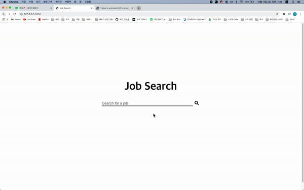

# JOB Scraper👩🏻‍💻
Description) python **web scraper** project

## ✔️ use
- Python3.9
- HTML
- CSS

## ✔️ modules
- requests
- BeautifulSoup4
- flask
    * Flask
    * render_template
    * request
    * redirect
    * send_file

### install modules
```
pip3 install requests
pip3 install BeautifulSoup4
pip3 install flask
```

## ✔️ features
- searching jobs
- printing job openings
- saving to CSV

## ✔️ preview
<center></center>